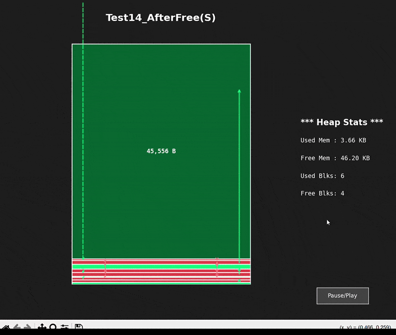

# Heap Visualizer

A Python-based animation tool that visualizes memory heap activity from custom C++ malloc/free allocators. This is especially useful for debugging fragmentation, coalescing, and allocator behavior.

> ⚠️ Note: This repo does not include the C++ allocator source code. All visuals are generated from memory snapshots (JSON files).

---

## Demo




---

## Features

- Visualizes memory blocks as red (used), light green (free), and dark green (coalesced)
- Displays live heap stats: used/free memory and block counts
- Hover over blocks to toggle between raw bytes and human-readable formats (e.g., KB, MB)
- Animates sequences of heap states to show progression
- GUI launcher to pick which test suite to visualize
- Cool UI :p

---

## How It Works

- The C++ allocator calls a `visualize("TestXX_StepY.json")` function.
- This dumps a JSON log describing the heap state at that point.
- The Python visualizer reads those logs and animates them chronologically.
- Each block includes: offset, size, type (free/used), and live heap stats.

---

## Directory Structure

```plaintext
custom_heap_memory_visualizer/
├── visualizer_multistage.py         # Main animation engine
├── heap_visualizer_launcher.py     # GUI launcher
├── Heap_VisualLogs/                # Contains .json log files from C++
│   ├── Test03_AfterInit.json
│   ├── Test03_AfterMalloc.json
│   └── ...
├── heap_visualizer_demo.gif        # Preview animation
└── README.md
```

## Credits & License

Created by Aditya Taneja  
Instructor: Prof. Ed Keenan  
Visual engine powered by matplotlib and Tkinter.

License: MIT (except C++ allocator code, not included)
